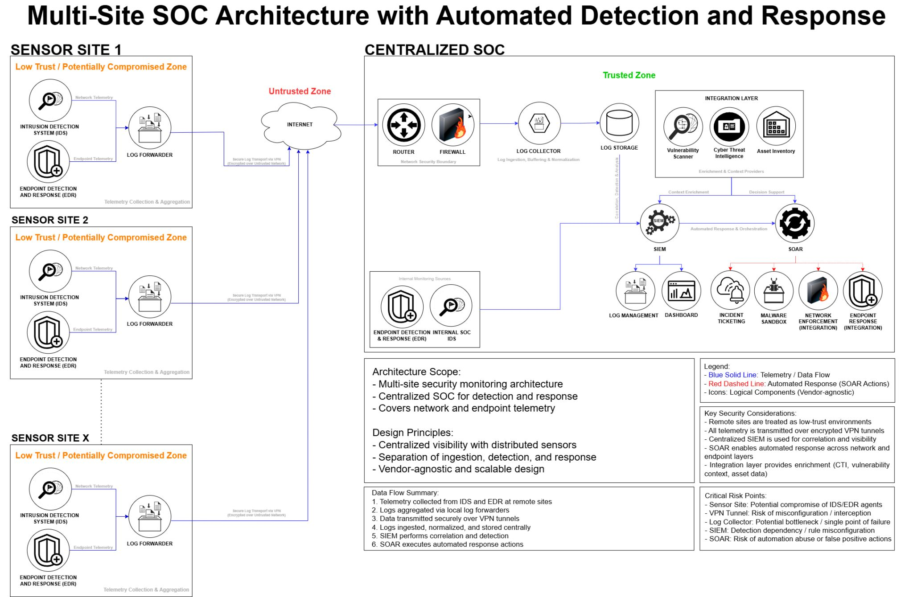

# Multi-Site SOC Architecture

A centralized Security Operations Center (SOC) architecture
designed for monitoring distributed sites through centralized
security telemetry, detection, enrichment, investigation,
and automated response.

## Objectives

- Centralize security visibility across distributed sites
- Secure telemetry transport from remote environments
- Correlate network and endpoint security telemetry
- Enrich security events with contextual intelligence
- Support automated security response
- Provide a scalable and vendor-agnostic architecture

## Architecture

The architecture separates remote telemetry collection from
centralized detection and response capabilities.

### Remote Sensor Layer

Each remote site contains security monitoring components such as:

- Intrusion Detection System (IDS)
- Endpoint Detection and Response (EDR)
- Log Forwarder

Remote sites are treated as low-trust or potentially compromised
environments.

### Secure Telemetry Transport

Security telemetry is forwarded from remote sites to the centralized
SOC through encrypted VPN tunnels.

### Centralized SOC

The centralized SOC provides:

- Network security boundary
- Log collection
- Centralized log storage
- SIEM-based detection and correlation
- Security orchestration and automated response
- Security monitoring and investigation

### Integration Layer

The SOC integrates additional security capabilities for context
enrichment and response, including:

- Vulnerability scanning
- Cyber threat intelligence
- Asset inventory
- Malware sandboxing
- Network enforcement
- Endpoint response
- Incident ticketing

## Data Flow

1. Security telemetry is collected at remote sites.
2. Network and endpoint telemetry is aggregated by local log forwarders.
3. Telemetry is transported through encrypted VPN tunnels.
4. Logs are collected, normalized, and centrally stored.
5. SIEM correlates telemetry and generates detections.
6. SOAR orchestrates response actions based on validated detections.

## Security Considerations

- Remote sensor environments may be compromised.
- VPN configuration and transport security must be protected.
- Centralized log collectors may become bottlenecks or single points of failure.
- SIEM availability is critical for centralized detection.
- Automated SOAR actions require safeguards against false positives and abuse.

## Design Principles

- Centralized visibility with distributed sensors
- Separation of ingestion, detection, and response
- Secure telemetry transport
- Scalable architecture
- Vendor-agnostic design