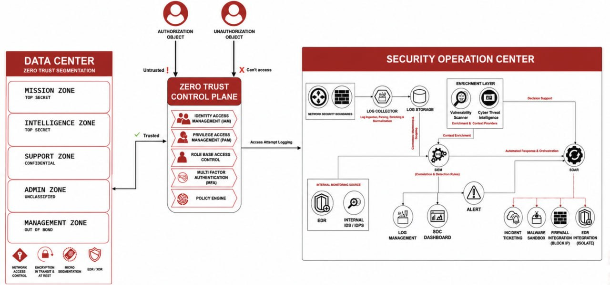

# Zero Trust Security Architecture for a Segmented Data Center

A reference Zero Trust security architecture designed for a
segmented, mission-critical environment with sensitive workloads
and controlled access requirements.

## Context

This architecture is based on security requirements derived from
a real-world mission-critical environment.

The design has been generalized and sanitized for portfolio purposes
and does not represent any specific internal or customer environment.

## Objectives

- Enforce identity-centric access control
- Apply least-privilege access
- Protect sensitive data center zones
- Control privileged access
- Centralize access and security monitoring
- Integrate access control with security operations

## Architecture

## Data Center Segmentation

The data center is divided into multiple security zones based on
sensitivity and operational requirements:

- Mission Zone
- Intelligence Zone
- Support Zone
- Admin Zone
- Management Zone

Segmentation is used to limit access between security domains and
reduce the potential impact of a compromised identity or system.

## Zero Trust Control Plane

The control plane provides centralized access-control capabilities:

- Identity and Access Management (IAM)
- Privileged Access Management (PAM)
- Role-Based Access Control (RBAC)
- Multi-Factor Authentication (MFA)
- Policy Engine

Access requests are evaluated before access to protected resources
is granted.

## Security Operations Integration

Access attempts are logged and forwarded to the Security Operations
Center (SOC).

The SOC provides:

- Log collection
- Centralized log storage
- SIEM-based correlation
- Alert generation
- Context enrichment
- Automated response and orchestration

## Security Principles

- Never implicitly trust access requests
- Enforce least-privilege access
- Verify identity before granting access
- Segment sensitive resources
- Monitor access attempts
- Integrate security controls with centralized detection and response

## Design Considerations

The architecture considers risks associated with:

- Unauthorized access
- Privileged account compromise
- Lateral movement
- Compromised endpoints
- Misconfigured access policies
- Security monitoring failures
- Automated response errors