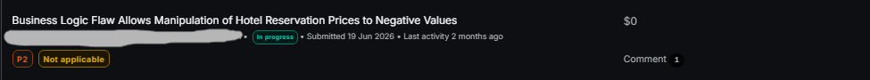

# Negative Hotel Reservation Pricing via Input Manipulation

**Category:** Business Logic / Improper Server-Side Input Validation  
**Platform:** Bug Bounty Research  
**Status:** Not Applicable — Security Layer On Final Stage (Testing Limit)

## Submission Proof



## Summary

A business logic weakness was identified in the hotel booking engine's room/rate calculation flow.

The `roomCount` parameter accepted negative integer values without server-side rejection. Supplying a negative quantity caused the backend to recalculate room pricing, service charges, government taxes, and the overall booking total as negative values.

The manipulated pricing values propagated through the reservation workflow and remained present through the review/guest information stage.

## Impact

- Manipulation of server-side reservation pricing calculations
- Negative room rates, service charges, and tax values
- Negative booking totals propagated through the reservation workflow
- Demonstrated failure to enforce expected business constraints on attacker-controlled input
- **No confirmed unauthorized booking, payment bypass, refund, or direct financial gain**

## Affected Component

- Hotel booking engine — room/rate calculation and reservation workflow
- `roomCount` parameter

## Reproduction Overview

The issue was validated using controlled manipulation of the booking workflow.

**Normal request:**

```http
POST /api/rateAndRoom/get
```

```json
{
  "roomCount": 1,
  "room": "REDACTED",
  "rate": "REDACTED"
}
```

The server returned a normal positive price.

**Manipulated request:**

```json
{
  "roomCount": -1,
  "room": "REDACTED",
  "rate": "REDACTED"
}
```

The server accepted the negative quantity and returned negative pricing values.

A larger negative value produced proportionally larger negative totals.

The manipulated values were then traced through the booking workflow and remained visible on the room selection and review/guest information stages.

## Technical Observation

The server accepted an attacker-controlled negative `roomCount` value and used it directly in pricing calculations.

This caused multiple server-side values to become negative:

```json
{
  "totalRoomPrice": "<negative>",
  "totalServiceCharge": "<negative>",
  "totalGovernmentTax": "<negative>",
  "totalPrice": "<negative>",
  "realPrice": "<negative>"
}
```

This confirms that the behavior was not limited to a client-side display manipulation.

## Expected Behavior

A guest should only be able to submit a valid positive room quantity.

The server should:

- Reject zero or negative `roomCount` values.
- Enforce input constraints before performing pricing calculations.
- Validate critical pricing values server-side.
- Independently validate transaction integrity before final reservation/payment processing.

## Validation

The behavior was reproduced through the booking workflow.

- Negative room quantities were accepted by the calculation endpoint.
- Server-side pricing calculations became negative.
- Negative values propagated through subsequent booking stages.
- The application reached the review/payment stage with the manipulated total.
- The final reservation could not be completed using the negative value.

No real payment was attempted and no unauthorized transaction was created.

## Testing Notes

- Testing was performed using controlled input manipulation.
- No real customer data was accessed.
- No destructive actions or real financial transactions were performed.
- Downstream reservation validation prevented completion of the manipulated transaction.


