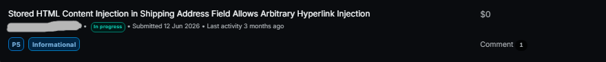

# Stored HTML Content Injection in Shipping Address Field

**Category:** HTML Injection  
**Platform:** Bugcrowd
**Authentication:** Not Required  
**Status:** P5 / Informative

## Submit Proof



## Summary

A stored HTML injection vulnerability was identified in the shipping address field `mafLine1` within the checkout flow.

User-supplied HTML was accepted by the backend, stored, and subsequently rendered as active HTML within the checkout page without proper output encoding.

The issue allows attacker-controlled HTML elements, including hyperlinks, to be injected into the rendered checkout content.

## Impact

The issue allows an attacker to manipulate how checkout content is
presented to users.

Potential impact includes:

- Content spoofing
- User interface manipulation
- Attacker-controlled hyperlinks
- Phishing-style redirection attempts
- Abuse of user trust through manipulated checkout content

JavaScript execution observed during testing and blocked by akamai WAF.

## Affected Component

- Shipping address field: `mafLine1`
- Checkout functionality

## Vulnerable Endpoint

```http
POST /rest/v2/~/{cartId}/addresses/delivery
```

## Reproduction Overview

1. Add a product to the cart.
2. Proceed to checkout.
3. Intercept the shipping address request.
4. Modify the mafLine1 parameter with attacker-controlled HTML. Example payload:

```html
<a href="https://www.evil.com">
 ```   
 
6. Submit the request.
7. Refresh or revisit the checkout page.
8. Observe that the supplied HTML is rendered as active markup.
9. Inspect the rendered DOM.

## Technical Observation

The server accepted a shipping address value containing HTML markup and subsequently rendered the value as active HTML instead of treating it as untrusted text.

The injected hyperlink became part of the rendered checkout DOM.

## Observed Behavior

The rendered checkout content included an attacker-controlled anchor element surrounding application-generated address content.

<div class="address-info user-address-detail">
    <ADDRESS_DATA>,
    <a href="https://www.evil.com">
        <ADDRESS_DATA>
    </a>
</div>

## Validation

The behavior was confirmed within the publicly accessible checkout flow using guest checkout functionality.

No JavaScript execution was observed during testing(Blocked by akamai WAF).

## Expected Behavior

User-controlled address fields should be rendered as plain text and must not be interpreted as HTML.

HTML supplied through the mafLine1 parameter should be encoded or rejected before being rendered in the checkout page.

## Testing Notes

- Testing was performed using guest checkout functionality.
- No destructive actions were performed.
- No additional downstream impact is claimed without direct verification.

## Remediation

- Apply context-appropriate output encoding before rendering user-controlled data in HTML contexts.
- Treat address fields as untrusted input.
- Render address data as plain text rather than interpreting supplied HTML markup.
